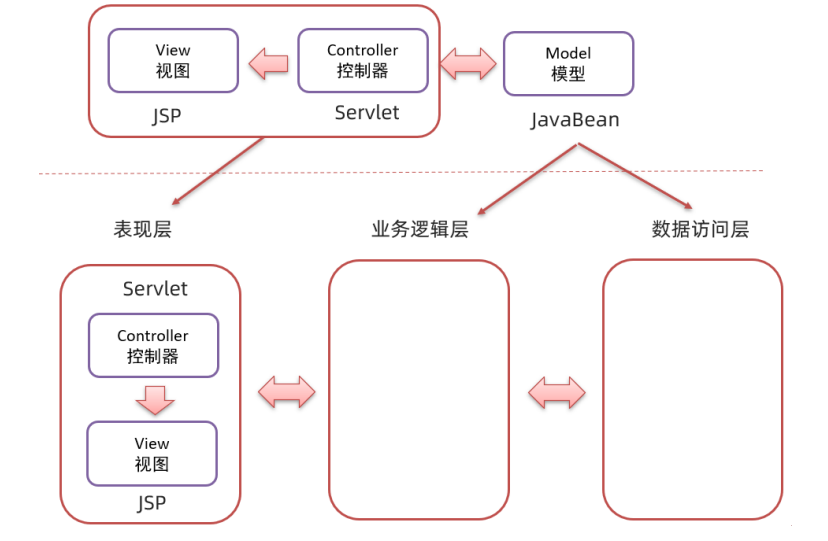

# 项目案例

## Web基础案例：

> 该部分案例来自于本人自学JavaWeb的练习项目，视频教程：[黑马程序员新版JavaWeb基础教程，Java web从入门到企业实战完整版](https://www.bilibili.com/video/BV1Qf4y1T7Hx/?p=1)

### 品牌查询案例(对应brandemo工程)：

>
> MVC和三层架构，利用JSP+Servlet实现




#### DAO层:

> 创建mybatis的配置文件

1. mybatis-config.xml:进行数据库连接配置，包映射:

```xml
<?xml version="1.0" encoding="UTF-8" ?>
<!DOCTYPE configuration
        PUBLIC "-//mybatis.org//DTD Config 3.0//EN"
        "http://mybatis.org/dtd/mybatis-3-config.dtd">
<configuration>
    <!--别名-->
    <!--<typeAliases>
        <package name="com.azy.pojo"/>
    </typeAliases>-->
    <!--
    environments：配置数据库连接环境信息。可以配置多个environment，通过default属性切换不同的environment
    -->
    <environments default="development">
        <environment id="development">
            <transactionManager type="JDBC"/>
            <dataSource type="POOLED">
                <!--数据库连接信息-->
                <property name="driver" value="com.mysql.cj.jdbc.Driver"/>
                <property name="url" value="jdbc:mysql:///mybatis?useSSL=false&amp;serverTimezone=GMT%2B8"/>
                <property name="username" value="root"/>
                <property name="password" value="123456"/>
            </dataSource>
        </environment>
    </environments>
    <mappers>
        <!--加载sql映射文件-->
        <!--<mapper resource="com/azy/mapper/UserMapper.xml"/>-->
        <package name="com.azy.mapper"/>
    </mappers>
</configuration>
```

2. BrandMapper.xml:对应namespace、数据库表和实体类的映射


```xml
<?xml version="1.0" encoding="UTF-8" ?>
<!DOCTYPE mapper PUBLIC "-//mybatis.org//DTD Mapper 3.0//EN"
        "http://mybatis.org/dtd/mybatis-3-mapper.dtd">
<!--namespace 表示对应的哪个文件-->
<mapper namespace="com.azy.mapper.BrandMapper">
    <resultMap id="brandResultMap" type="com.azy.pojo.Brand">
        <result column="brand_name" property="brandName"/>
        <result column="company_name" property="companyName"/>
    </resultMap>

</mapper>
```

3. 接口BrandMapper:对应方法，同时在BrandMapper.xml中写相应SQL语句


```java
public  interface BrandMapper {

    @Select("select * from tb_brand")
    @ResultMap("brandResultMap")
    List<Brand> selectAll();
}
```

#### Service层:

> 建立通用的BrandService类，编写操作数据的对应方法

1. SqlSessionFactory工具类，只生成一次SqlSessionFactory类

```java
public class SqlSessionFactoryUtils {
    private  static final SqlSessionFactory sqlSessionFactory;
    static {
        String resource = "mybatis-config.xml";
        InputStream inputStream = null;
        try {
            inputStream = Resources.getResourceAsStream(resource);
        } catch (IOException e) {
            e.printStackTrace();
        }
        sqlSessionFactory = new SqlSessionFactoryBuilder().build(inputStream);
    }

    public static SqlSessionFactory getSqlSessionFactory(){
        return sqlSessionFactory;
    }
}
```

2. 在BrandService类中编写操作数据的对应方法

```java
public class BrandService {
    private SqlSessionFactory sqlSessionFactory;
    
    public List<Brand> selectAll(){
        sqlSessionFactory = SqlSessionFactoryUtils.getSqlSessionFactory();
        SqlSession sqlSession = sqlSessionFactory.openSession();
        
        BrandMapper mapper = sqlSession.getMapper(BrandMapper.class);
        
        List<Brand> brands = mapper.selectAll();

        sqlSession.close();

        return brands;
    }
}
```

#### Web层:

> 对应具体的页面操作

1. servlet处理数据数据并进行再转发

```java
@WebServlet(value = "/selectAllServlet")
public class SelectAllServlet extends HttpServlet {
    private BrandService brandService = new BrandService();

    @Override
    protected void doGet(HttpServletRequest request, HttpServletResponse response) throws ServletException, IOException {
        List<Brand> brands = brandService.selectAll();

        request.setAttribute("brands",brands);
        System.out.println(brands);
        request.getRequestDispatcher("/brand.jsp").forward(request,response);
    }

    @Override
    protected void doPost(HttpServletRequest request, HttpServletResponse response) throws ServletException, IOException {
        this.doGet(request,response);
    }
}
```

2. JSP页面接收数据并展示

```html
<%@ page contentType="text/html;charset=UTF-8" language="java" isELIgnored="false"%>
<%@ taglib prefix="c" uri="http://java.sun.com/jsp/jstl/core" %>
<%--jstl标签--%>
<!DOCTYPE html>
<html lang="en">
<head>
    <meta charset="UTF-8">
    <title>Title</title>
</head>
<body>
<hr>
<table border="1" cellspacing="0" width="90%">
    <tr>
        <th>序号</th>
        <th>品牌名称</th>
        <th>企业名称</th>
        <th>排序</th>
        <th>品牌介绍</th>
        <th>状态</th>
        <th>操作</th>
    </tr>
    <c:forEach items="${brands}" var="brand" varStatus="status">
        <tr align="center">
                <%--依次递增--%>
            <td>${status.count}</td>
            <td>${brand.brandName}</td>
            <td>${brand.companyName}</td>
            <td>${brand.ordered}</td>
            <td>${brand.description}</td>
            <c:if test="${brand.status == 1}">
                <td>启用</td>
            </c:if>
            <c:if test="${brand.status != 1}">
                <td>禁用</td>
            </c:if>
            <td><a href="/brand-demo/selectByIdServlet?id=${brand.id}">修改</a> <a href="#">删除</a></td>
        </tr>
    </c:forEach>
</table>
</body>
</html>
```

EL表达式不显示就需要设置：isELIgnored="false"


JavaScript按钮跳转：

```javascript
<input type="button" value="新增" id="add"><br>

<script>
    document.getElementById("add").onclick = function () {
        location.href = "/BrandDemo/addBrand.jsp"
    }
</script>
```

HTML的隐藏域：

```html
<input type="hidden" name="id" value="${brand.id}">
```
